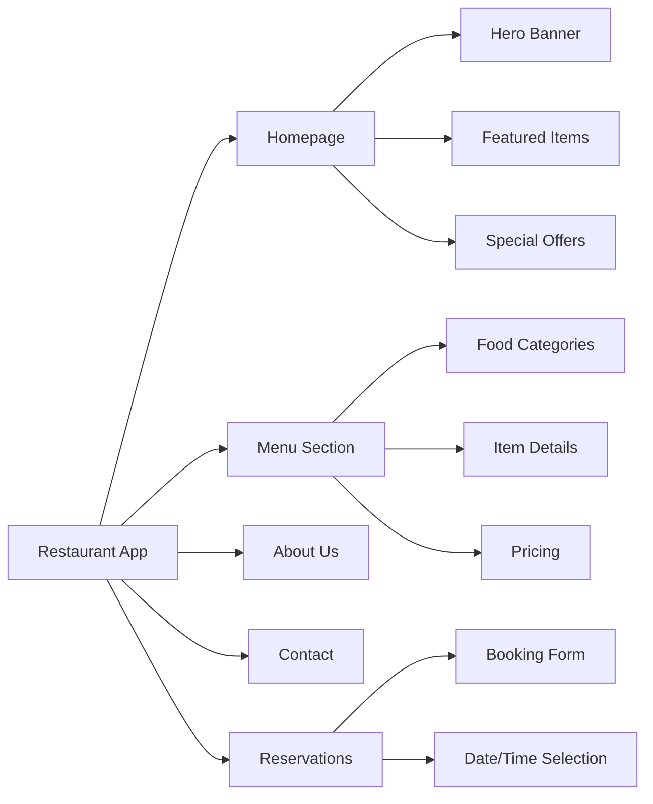

# 🍽️ React Restaurant Demo

<div align="center">
  
  

  ### ⚛️ Modern Restaurant Website Built with React + Vite

  [](https://restaurant-black-pi-23.vercel.app)
  [](https://github.com/bharat-poojari/restaurant/stargazers)
  [](https://github.com/bharat-poojari/restaurant/network)
  [](https://opensource.org/licenses/MIT)
  [](https://react.dev)
  [](https://vitejs.dev)
  
  <p align="center">
    <a href="#-overview"><strong>Overview</strong></a> •
    <a href="#-live-demo"><strong>Live Demo</strong></a> •
    <a href="#-features"><strong>Features</strong></a> •
    <a href="#-installation"><strong>Installation</strong></a> •
    <a href="#-technology-stack"><strong>Tech Stack</strong></a> •
    <a href="#-project-structure"><strong>Structure</strong></a> •
    <a href="#-contributing"><strong>Contributing</strong></a>
  </p>
</div>

---

## 📋 Table of Contents

- [🌟 Overview](#-overview)
- [🎯 Live Demo](#-live-demo)
- [✨ Features](#-features)
- [📸 Screenshots](#-screenshots)
- [🚀 Installation](#-installation)
- [📁 Project Structure](#-project-structure)
- [🛠️ Technology Stack](#️-technology-stack)
- [💻 Available Scripts](#-available-scripts)
- [🎨 Customization](#-customization)
- [📱 Responsive Design](#-responsive-design)
- [🚀 Deployment](#-deployment)
- [🗺️ Roadmap](#️-roadmap)
- [🤝 Contributing](#-contributing)
- [📄 License](#-license)
- [👤 Author & Contact](#-author--contact)
- [🙏 Acknowledgments](#-acknowledgments)

---

## 🌟 Overview

**React Restaurant Demo** is a modern, responsive restaurant website built with **React 19** and **Vite**. This project serves as a demonstration of building fast, component-based web applications with the latest React features and Vite's lightning-fast build tooling.

### 🎯 **Project Purpose**

| Aspect | Description |
|--------|-------------|
| **Learning Goal** | Demonstrate React component architecture and Vite build optimization |
| **Key Features** | Component-based UI, Hot Module Replacement, optimized production builds |
| **Target Audience** | Developers learning React, restaurant businesses seeking modern web presence |
| **Deployment** | Vercel with automatic CI/CD from GitHub |

### 💡 **Why This Stack?**

| Feature | Traditional Setup | **React + Vite** |
|---------|-------------------|------------------|
| **Development Server** | Slow startup | ✅ **Instant cold start** |
| **Hot Reload** | Full page refresh | ✅ **HMR preserves state** |
| **Build Time** | Minutes | ✅ **Seconds with esbuild** |
| **Configuration** | Complex webpack | ✅ **Zero-config to start** |
| **Production Build** | Large bundle | ✅ **Optimized code splitting** |

---

## 🎯 Live Demo

<div align="center">

### 🌐 **Experience the Restaurant Website Live!**

[](https://restaurant-black-pi-23.vercel.app)

**🔗 URL:** [https://restaurant-black-pi-23.vercel.app](https://restaurant-black-pi-23.vercel.app)

*Deployed on Vercel • Automatic CI/CD • Always Up-to-Date*

</div>

---

## ✨ Features

### 🚀 **Core Features**



**Detailed Feature List:**

| Feature | Description | Technology |
|---------|-------------|------------|
| **⚡ Fast Loading** | Vite's optimized build ensures quick page loads | Vite + Code Splitting |
| **🔄 Hot Module Replacement** | Instant updates during development without page reload | Vite HMR |
| **📱 Fully Responsive** | Mobile-first design that works on all devices | CSS Flexbox/Grid |
| **🎨 Modern UI** | Clean, contemporary restaurant website design | CSS Modules / Styled Components |
| **🔍 SEO Optimized** | Meta tags and semantic HTML structure | React Helmet |
| **📦 Optimized Build** | Minified and tree-shaken production bundle | Vite + esbuild |
| **🛠️ ESLint Configured** | Code quality and consistency maintained | ESLint |

### 🎨 **UI Components**

| Component | Purpose | Features |
|-----------|---------|----------|
| **Header/Navigation** | Site navigation | Responsive hamburger menu, smooth scroll |
| **Hero Section** | First impression | High-quality imagery, call-to-action buttons |
| **Menu Display** | Showcase food items | Category filtering, item cards |
| **About Section** | Restaurant story | Engaging content, chef highlights |
| **Contact Form** | Customer inquiries | Form validation, submission handling |
| **Footer** | Site information | Social links, contact info, hours |

---

## 📸 Screenshots

<div align="center">

### 🎨 **Website Interface Preview**

<table>
  <tr>
    <td><strong>🏠 Homepage Hero</strong></td>
    <td><strong>🍕 Menu Section</strong></td>
  </tr>
  <tr>
    <td></td>
    <td></td>
  </tr>
  <tr>
    <td><strong>📖 About Page</strong></td>
    <td><strong>📞 Contact Section</strong></td>
  </tr>
  <tr>
    <td></td>
    <td></td>
  </tr>
</table>

### 📱 **Mobile Responsive Design**

| Mobile View | Tablet View |
|-------------|-------------|
| Optimized for small screens | Adaptive layout for medium screens |

</div>

> **📸 Note:** Actual screenshots coming soon! Visit the [Live Demo](https://restaurant-black-pi-23.vercel.app) to see the website in action.

---

## 🚀 Installation

### 📋 **Prerequisites**

| Component | Requirement | Purpose |
|-----------|-------------|---------|
| **Node.js** | 18+ or 20+ | JavaScript runtime |
| **npm/yarn/pnpm** | Latest version | Package management |
| **Git** | Optional | Version control |
| **Modern Browser** | Chrome/Firefox/Safari | Viewing the application |

### ⚡ **Step-by-Step Installation**

<details>
<summary><b>1️⃣ Clone Repository</b></summary>

```bash
# Clone the repository
git clone https://github.com/bharat-poojari/restaurant.git

# Navigate to project directory
cd restaurant
```
</details>

<details>
<summary><b>2️⃣ Install Dependencies</b></summary>

```bash
# Using npm
npm install

# Using yarn
yarn install

# Using pnpm
pnpm install
```
</details>

<details>
<summary><b>3️⃣ Start Development Server</b></summary>

```bash
# Using npm
npm run dev

# Using yarn
yarn dev

# Using pnpm
pnpm dev
```

The application will be available at `http://localhost:5173` (or another port if 5173 is occupied).
</details>

<details>
<summary><b>4️⃣ Build for Production</b></summary>

```bash
# Create optimized production build
npm run build

# The build output will be in the `dist/` directory
```
</details>

<details>
<summary><b>5️⃣ Preview Production Build</b></summary>

```bash
# Preview the production build locally
npm run preview

# Available at http://localhost:4173
```
</details>

---

## 📁 Project Structure

```
restaurant/
│
├── 📂 public/                     # Static assets
│   ├── 🖼️ favicon.ico
│   ├── 🖼️ logo.png
│   └── 📄 robots.txt
│
├── 📂 src/                        # Source code
│   ├── 📂 assets/                # Images, fonts, etc.
│   │   ├── 📂 images/
│   │   │   ├── 🖼️ hero-bg.jpg
│   │   │   ├── 🖼️ menu-items/
│   │   │   └── 🖼️ gallery/
│   │   └── 📂 fonts/
│   │
│   ├── 📂 components/            # Reusable React components
│   │   ├── 📄 Header.jsx
│   │   ├── 📄 Header.module.css
│   │   ├── 📄 Footer.jsx
│   │   ├── 📄 Footer.module.css
│   │   ├── 📂 common/
│   │   │   ├── 📄 Button.jsx
│   │   │   ├── 📄 Card.jsx
│   │   │   └── 📄 Modal.jsx
│   │   └── 📂 layout/
│   │       ├── 📄 Container.jsx
│   │       └── 📄 Grid.jsx
│   │
│   ├── 📂 pages/                 # Page components
│   │   ├── 📄 Home.jsx
│   │   ├── 📄 Menu.jsx
│   │   ├── 📄 About.jsx
│   │   ├── 📄 Contact.jsx
│   │   └── 📄 Reservation.jsx
│   │
│   ├── 📂 hooks/                 # Custom React hooks
│   │   ├── 📄 useScroll.js
│   │   └── 📄 useWindowSize.js
│   │
│   ├── 📂 utils/                 # Utility functions
│   │   ├── 📄 constants.js
│   │   └── 📄 helpers.js
│   │
│   ├── 📂 styles/                # Global styles
│   │   ├── 📄 global.css
│   │   ├── 📄 variables.css
│   │   └── 📄 animations.css
│   │
│   ├── 📄 App.jsx                # Root component
│   ├── 📄 App.css                # App-specific styles
│   ├── 📄 main.jsx               # Entry point
│   └── 📄 index.css              # Global CSS
│
├── 📄 index.html                  # HTML template
├── 📄 vite.config.js             # Vite configuration
├── 📄 eslint.config.js           # ESLint configuration
├── 📄 package.json               # Dependencies and scripts
├── 📄 .gitignore                 # Git ignore rules
├── 📄 README.md                  # Project documentation
└── 📄 LICENSE                    # MIT License
```

### 📊 **File Organization Philosophy**

| Directory | Purpose | Naming Convention |
|-----------|---------|-------------------|
| `components/` | Reusable UI pieces | PascalCase for components |
| `pages/` | Route-level components | PascalCase matching routes |
| `hooks/` | Custom React hooks | `use` prefix, camelCase |
| `utils/` | Helper functions | camelCase |
| `styles/` | Global styling | kebab-case for CSS files |

---

## 🛠️ Technology Stack

### 📊 **Complete Tech Stack Overview**

| Category | Technology | Version | Purpose |
|----------|------------|---------|---------|
| **Framework** | React | 19.0.0 | UI component library |
| **Build Tool** | Vite | 6.2.0 | Development server & bundler |
| **Package Manager** | npm/yarn/pnpm | Latest | Dependency management |
| **Linting** | ESLint | 9.x | Code quality |
| **Styling** | CSS Modules / CSS | Latest | Component styling |
| **Deployment** | Vercel | Latest | Hosting & CI/CD |
| **Version Control** | Git | Latest | Source control |

### 📦 **Key Dependencies**

```json
{
  "dependencies": {
    "react": "^19.0.0",
    "react-dom": "^19.0.0"
  },
  "devDependencies": {
    "@eslint/js": "^9.21.0",
    "@types/react": "^19.0.10",
    "@types/react-dom": "^19.0.4",
    "@vitejs/plugin-react": "^4.3.4",
    "eslint": "^9.21.0",
    "eslint-plugin-react-hooks": "^5.1.0",
    "eslint-plugin-react-refresh": "^0.4.19",
    "globals": "^15.15.0",
    "vite": "^6.2.0"
  }
}
```

### ⚙️ **Vite Configuration**

```javascript
// vite.config.js
import { defineConfig } from 'vite'
import react from '@vitejs/plugin-react'

export default defineConfig({
  plugins: [react()],
  server: {
    port: 5173,
    open: true
  },
  build: {
    outDir: 'dist',
    sourcemap: false,
    minify: 'esbuild',
    rollupOptions: {
      output: {
        manualChunks: {
          vendor: ['react', 'react-dom']
        }
      }
    }
  }
})
```

---

## 💻 Available Scripts

### 📜 **NPM Scripts Reference**

| Script | Command | Description |
|--------|---------|-------------|
| **Development** | `npm run dev` | Start development server with HMR |
| **Build** | `npm run build` | Create optimized production build |
| **Preview** | `npm run preview` | Preview production build locally |
| **Lint** | `npm run lint` | Run ESLint to check code quality |

### 🔧 **Using the Scripts**

```bash
# Development mode (with hot reload)
npm run dev
# Visit http://localhost:5173

# Production build
npm run build
# Output: dist/ directory

# Preview production build
npm run preview
# Visit http://localhost:4173

# Check code quality
npm run lint
# Displays any linting errors/warnings
```

---

## 🎨 Customization

### 🎨 **Styling Customization**

<details>
<summary><b>CSS Variables Reference</b></summary>

```css
/* src/styles/variables.css */
:root {
    /* Color Palette */
    --primary: #e63946;
    --primary-dark: #c1121f;
    --primary-light: #ff6b6b;
    --secondary: #457b9d;
    --accent: #f4a261;
    
    /* Neutral Colors */
    --dark: #1d3557;
    --gray: #6c757d;
    --light: #f8f9fa;
    --white: #ffffff;
    
    /* Typography */
    --font-primary: 'Poppins', sans-serif;
    --font-secondary: 'Playfair Display', serif;
    
    /* Spacing */
    --spacing-xs: 0.25rem;
    --spacing-sm: 0.5rem;
    --spacing-md: 1rem;
    --spacing-lg: 1.5rem;
    --spacing-xl: 2rem;
    --spacing-xxl: 3rem;
    
    /* Breakpoints */
    --mobile: 576px;
    --tablet: 768px;
    --desktop: 1024px;
    --wide: 1200px;
}
```
</details>

### 🎨 **Adding New Components**

```jsx
// Example: Creating a new MenuCard component
// src/components/MenuCard.jsx
import styles from './MenuCard.module.css';

const MenuCard = ({ title, description, price, image }) => {
  return (
    <div className={styles.card}>
      
      <h3 className={styles.title}>{title}</h3>
      <p className={styles.description}>{description}</p>
      <span className={styles.price}>${price}</span>
    </div>
  );
};

export default MenuCard;
```

### 📄 **Adding New Pages**

```jsx
// 1. Create new page component
// src/pages/Gallery.jsx
const Gallery = () => {
  return (
    <div className="gallery-page">
      <h1>Our Gallery</h1>
      {/* Gallery content */}
    </div>
  );
};

export default Gallery;

// 2. Add route in App.jsx
import Gallery from './pages/Gallery';

// In your router setup
<Route path="/gallery" element={<Gallery />} />

// 3. Add navigation link
<Link to="/gallery">Gallery</Link>
```

---

## 📱 Responsive Design

### 📊 **Breakpoint System**

| Breakpoint | Screen Width | Layout Adjustments |
|------------|--------------|-------------------|
| **Mobile** | < 576px | Single column, hamburger menu |
| **Tablet** | 576px - 768px | Two columns, condensed navigation |
| **Desktop** | 768px - 1024px | Full navigation, multi-column |
| **Wide** | > 1024px | Maximum width container, enhanced spacing |

### 📱 **Mobile-First Approach**

```css
/* Mobile-first CSS example */
.container {
    padding: var(--spacing-md);
}

/* Tablet and up */
@media (min-width: 768px) {
    .container {
        padding: var(--spacing-lg);
    }
}

/* Desktop and up */
@media (min-width: 1024px) {
    .container {
        max-width: 1200px;
        margin: 0 auto;
    }
}
```

---

## 🚀 Deployment

### 🌐 **Deploy to Vercel (Recommended)**

<details>
<summary><b>Step-by-Step Vercel Deployment</b></summary>

1. **Push to GitHub**
   ```bash
   git add .
   git commit -m "Ready for deployment"
   git push origin main
   ```

2. **Connect to Vercel**
   - Visit [Vercel](https://vercel.com)
   - Sign in with GitHub
   - Click "New Project"
   - Import your repository

3. **Configure Settings**
   - Framework Preset: Vite
   - Build Command: `npm run build`
   - Output Directory: `dist`
   - Install Command: `npm install`

4. **Deploy**
   - Click "Deploy"
   - Vercel provides a unique URL
   - Automatic deployments on future pushes
</details>

### 📦 **Other Deployment Options**

| Platform | Command | Notes |
|----------|---------|-------|
| **Netlify** | Drag & drop `dist/` folder | Or connect GitHub |
| **GitHub Pages** | `npm run build` → deploy `dist/` | Use `gh-pages` package |
| **Cloudflare Pages** | Connect GitHub repository | Automatic builds |
| **Static Hosting** | Upload `dist/` contents | Any static hosting |

---

## 🗺️ Roadmap

### **Phase 1: Core Features (Complete) ✅**
- [x] React + Vite setup
- [x] Responsive layout
- [x] Homepage with hero section
- [x] Menu display page
- [x] About page
- [x] Contact page with form
- [x] ESLint configuration
- [x] Vercel deployment

### **Phase 2: Enhanced Features (In Progress) 🏗️**
- [ ] Online reservation system
- [ ] Menu filtering by category
- [ ] Shopping cart functionality
- [ ] Dark/Light theme toggle
- [ ] Animation on scroll (AOS)
- [ ] SEO optimization with React Helmet
- [ ] PWA support

### **Phase 3: Advanced Features (Planned) 🚀**
- [ ] Backend API integration
- [ ] User authentication
- [ ] Admin dashboard for menu management
- [ ] Online ordering system
- [ ] Payment gateway integration
- [ ] Customer reviews system
- [ ] Email notifications

### **Phase 4: Optimization (Future) 🔮**
- [ ] Image optimization with lazy loading
- [ ] Performance monitoring
- [ ] A/B testing setup
- [ ] Analytics integration
- [ ] Internationalization (i18n)

---

## 🤝 Contributing

### 🌟 **We Welcome Contributions!**

| Contribution Type | Description | Good For |
|-------------------|-------------|----------|
| **🐛 Bug Reports** | Report issues and bugs | Everyone |
| **💡 Feature Requests** | Suggest new features | Users & Developers |
| **📝 Documentation** | Improve README, add comments | Technical Writers |
| **💻 Code** | Fix bugs, add features | React Developers |
| **🎨 Design** | Improve UI/UX | Designers |

### 📋 **Contribution Workflow**

```bash
# 1. Fork the repository
# Click 'Fork' button on GitHub

# 2. Clone your fork
git clone https://github.com/your-username/restaurant.git
cd restaurant

# 3. Create feature branch
git checkout -b feature/amazing-feature

# 4. Install dependencies
npm install

# 5. Make changes and test
npm run dev

# 6. Lint your code
npm run lint

# 7. Commit changes
git add .
git commit -m '✨ Add amazing feature'

# 8. Push to your fork
git push origin feature/amazing-feature

# 9. Open Pull Request
```

### ✅ **Code Standards**

```jsx
// Use functional components with hooks
const ComponentName = ({ prop1, prop2 }) => {
  // Hooks at the top
  const [state, setState] = useState(initialValue);
  
  // Event handlers
  const handleClick = () => {
    // Logic
  };
  
  // Render
  return (
    <div className="component-name">
      {/* JSX */}
    </div>
  );
};

// PropTypes or TypeScript for type checking
ComponentName.propTypes = {
  prop1: PropTypes.string.isRequired,
  prop2: PropTypes.number
};

export default ComponentName;
```

---

## 📄 License

Distributed under the **MIT License**. See `LICENSE` file for more information.

```
MIT License

Copyright (c) 2026 Bharat Poojari

Permission is hereby granted, free of charge, to any person obtaining a copy
of this software and associated documentation files (the "Software"), to deal
in the Software without restriction, including without limitation the rights
to use, copy, modify, merge, publish, distribute, sublicense, and/or sell
copies of the Software, and to permit persons to whom the Software is
furnished to do so, subject to the following conditions:

The above copyright notice and this permission notice shall be included in all
copies or substantial portions of the Software.

THE SOFTWARE IS PROVIDED "AS IS", WITHOUT WARRANTY OF ANY KIND, EXPRESS OR
IMPLIED, INCLUDING BUT NOT LIMITED TO THE WARRANTIES OF MERCHANTABILITY,
FITNESS FOR A PARTICULAR PURPOSE AND NONINFRINGEMENT. IN NO EVENT SHALL THE
AUTHORS OR COPYRIGHT HOLDERS BE LIABLE FOR ANY CLAIM, DAMAGES OR OTHER
LIABILITY, WHETHER IN AN ACTION OF CONTRACT, TORT OR OTHERWISE, ARISING FROM,
OUT OF OR IN CONNECTION WITH THE SOFTWARE OR THE USE OR OTHER DEALINGS IN THE
SOFTWARE.
```

---

## 👤 Author & Contact

<div align="center">

### Bharat Poojari
**Full-Stack Developer & React Enthusiast**

*Building modern web applications with React and cutting-edge tooling*

[](https://bharat-poojari.vercel.app)
[](https://github.com/bharat-poojari)
[](https://linkedin.com/in/bharat-poojari-397618359)
[](https://kaggle.com/bharatpoojari03)
[](mailto:bharatp0316@gmail.com)

</div>

### 📞 **Project Links**

| Resource | Link | Purpose |
|----------|------|---------|
| **GitHub Repository** | [restaurant](https://github.com/bharat-poojari/restaurant) | Source code |
| **Live Demo** | [View Website](https://restaurant-black-pi-23.vercel.app) | Production deployment |
| **Issues** | [Report Issue](https://github.com/bharat-poojari/restaurant/issues) | Bug reports |
| **Discussions** | [Q&A](https://github.com/bharat-poojari/restaurant/discussions) | Community support |

---

## 🙏 Acknowledgments

### 🛠️ **Technologies & Tools**

| Project | Purpose | License |
|---------|---------|---------|
| **[React](https://react.dev)** | UI library | MIT |
| **[Vite](https://vitejs.dev)** | Build tool | MIT |
| **[ESLint](https://eslint.org)** | Linting | MIT |
| **[Vercel](https://vercel.com)** | Hosting | Free tier |

### 📚 **Learning Resources**

- **[React Documentation](https://react.dev/)** - Official React docs
- **[Vite Guide](https://vitejs.dev/guide/)** - Vite documentation
- **[MDN Web Docs](https://developer.mozilla.org/)** - Web standards

### 👏 **Special Thanks**

- **React Team** - For the amazing framework
- **Vite Team** - For the blazing fast tooling
- **Open Source Community** - For continuous inspiration

---

## ⭐ Support the Project

If you find this project helpful, please consider:

<div align="center">

[](https://github.com/bharat-poojari/restaurant)
[](https://twitter.com/intent/tweet?text=Check%20out%20this%20modern%20React%20Restaurant%20Website%20built%20with%20Vite!%20https://github.com/bharat-poojari/restaurant)
[](https://github.com/sponsors/bharat-poojari)

### 📊 Project Statistics


</div>

---

<div align="center">

### 🍽️ Modern Restaurant Website Built with React + Vite

[](https://restaurant-black-pi-23.vercel.app)


**© 2026 Bharat Poojari. Released under MIT License.**

*Built for learning and demonstration - A modern React application with Vite's lightning-fast tooling* ⚛️✨

</div>
